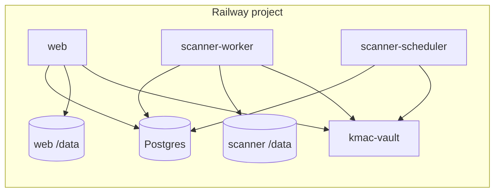

# Deploy DealershipScanner to Railway

Production uses the **central kmac-vault Railway project** (`https://kmac-vault-production.up.railway.app`). DealershipScanner is its **own Railway project**; the web app loads `Dealer:*` keys from vault at startup.

## Architecture



## Full stack (web + harvesting)

Production runs **everything on Railway**: consumer web, Postgres inventory/job queue, and scraper fleet.

```bash
railway link -p dealership-scanner -s web
./deploy/railway/setup-full-stack.sh
./deploy/railway/sync-vault-to-railway.sh   # web; repeat with RAILWAY_SERVICE=scanner-worker
```

| Service | Dockerfile | Config file (per service in dashboard) |
|---------|------------|----------------------------------------|
| `web` | `Dockerfile.web` | `deploy/railway/railway.web.toml` |
| `scanner-worker` | `Dockerfile.scanner-worker` | `deploy/railway/railway.scanner-worker.toml` |
| `scanner-scheduler` | `Dockerfile.scanner-scheduler` | `deploy/railway/railway.scanner-scheduler.toml` |
| `Postgres` | template | `INVENTORY_DATABASE_URL=${{Postgres.DATABASE_URL}}` on all app services |

Set **`RAILWAY_DOCKERFILE_PATH`** per service (setup script does this). Do **not** use a single root `railway.toml` for a monorepo — it forces every service onto `Dockerfile.web`.

Attach a **Volume at `/data`** on `scanner-worker` (browser profiles + scanner SQLite scratch). Recommend **2 GB+ RAM** per worker replica; scale replicas in Railway or `railway.scanner-worker.toml`.

Only **one** sensitive bootstrap variable is required on each app service: `VAULT_TOKEN` (bearer token for kmac-vault). Everything else (`GOOGLE_MAPS_API_KEY`, SQLCipher keys, etc.) is fetched from vault at runtime.

## Prerequisites

- [Railway CLI](https://docs.railway.com/guides/cli): `npm i -g @railway/cli` or `brew install railway`
- Logged in: `railway login`
- **kmac-vault** service already deployed in the same Railway project
- Project linked: `railway link` (from repo root, on the **web** service)

## 1. Deploy services

Per-service config lives under `deploy/railway/railway.*.toml`. Connect GitHub `main` to each service, or:

```bash
railway up -s web
railway up -s scanner-worker
railway up -s scanner-scheduler
```

## 2. Wire vault connection (recommended)

Run locally after `railway link`:

```bash
./deploy/railway/sync-vault-to-railway.sh
```

This sets:

| Railway variable | Value |
|------------------|--------|
| `KMAC_VAULT_AUTO` | `1` |
| `VAULT_ADDR` | `http://kmac-vault.railway.internal:9999` (override with `--vault-addr`) |
| `VAULT_TOKEN` | Copied from local kmac vault token (must match Railway vault) |
| `VAULT_LOAD_RETRIES` | `8` (vault may cold-start after deploy) |
| `FLASK_ENV` | `production` |
| DB paths | `/data/*.db` |

If your vault service uses a different name or port, set `VAULT_ADDR` explicitly:

```bash
./deploy/railway/sync-vault-to-railway.sh --vault-addr 'http://my-vault.railway.internal:9999'
```

### Railway variable references (dashboard alternative)

In the web service → Variables, you can reference the vault service:

```
VAULT_ADDR=http://${{kmac-vault.RAILWAY_PRIVATE_DOMAIN}}:${{kmac-vault.PORT}}
```

Set `VAULT_TOKEN` to the same bearer token the kmac-vault service uses (copy once from vault deploy config).

### Fallback: mirror secrets into Railway

Only if vault is temporarily unavailable:

```bash
./deploy/railway/sync-vault-to-railway.sh --mirror-secrets
```

## 3. Required Railway variables (web service)

| Variable | Source | Notes |
|----------|--------|--------|
| `KMAC_VAULT_AUTO` | script | `1` |
| `VAULT_ADDR` | script | Private URL to kmac-vault |
| `VAULT_TOKEN` | script / manual | Bearer token only |
| `FLASK_ENV` | script | `production` |
| `PUBLIC_BASE_URL` | manual | `https://<your-railway-domain>` |
| `APP_ADMIN_USERNAMES` | script | `asarrafi` |
| `APP_ADMIN_EMAILS` | script | `asarrafi@sarraficars.com` |

App secrets (`GOOGLE_MAPS_API_KEY`, `SECRET_KEY`, SQLCipher keys, etc.) live in vault under `Dealer:*` — **do not** duplicate unless using `--mirror-secrets`.

## 4. Persistent data (SQLite)

Attach a **Volume** on the web service mounted at `/data`:

```
INVENTORY_DB_PATH=/data/inventory.db
USERS_DB_PATH=/data/users.db
DEV_USERS_DB_PATH=/data/dev_users.db
DEALER_PORTAL_DB_PATH=/data/dealer_portal.db
SCANNER_VDP_IMAGE_DOWNLOAD_DIR=/data/vdp_images
```

Upload initial DBs or run discovery/scans after first deploy.

## 5. Health check

Railway uses `GET /health` (configured in `railway.toml`). App binds to `0.0.0.0:$PORT` automatically.

## 6. Custom domain

In Railway → Settings → Networking → add domain, then set `PUBLIC_BASE_URL` to that URL.

## Local vs Railway

| | Local Docker | Railway |
|--|--------------|---------|
| Vault | `host.docker.internal:9999` | `kmac-vault.railway.internal:9999` |
| Auto-load | `KMAC_VAULT_AUTO=1` | `KMAC_VAULT_AUTO=1` + `VAULT_ADDR` + `VAULT_TOKEN` |
| Port | `WEB_PORT` (default 18000) | Railway `PORT` |
| DB encryption | `ALLOW_UNENCRYPTED_USER_DB=1` ok | SQLCipher keys from vault |

## Verify after deploy

```bash
railway logs
```

Look for: `Loaded N secret(s) from kmac vault: GOOGLE_MAPS_API_KEY, ...`

Dealer finder API should report `google_available: true` when `Dealer:google_maps_api_key` is in Railway vault.
