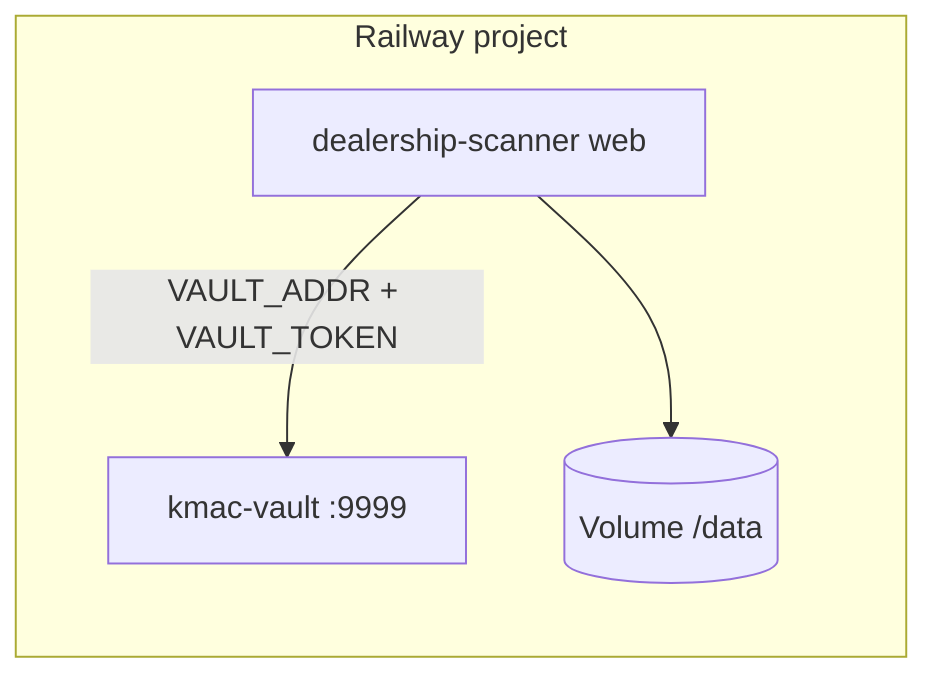

# Deploy DealershipScanner to Railway

Production uses the **central kmac-vault Railway project** (`https://kmac-vault-production.up.railway.app`). DealershipScanner is its **own Railway project**; the web app loads `Dealer:*` keys from vault at startup.

## Architecture


```mermaid
flowchart LR
  subgraph railway [Railway project]
    Web[dealership-scanner web]
    Vault[kmac-vault :9999]
    Vol[(Volume /data)]
  end
  Web -->|"VAULT_ADDR + VAULT_TOKEN"| Vault
  Web --> Vol
```

Only **one** sensitive bootstrap variable is required on the web service: `VAULT_TOKEN` (bearer token for kmac-vault). Everything else (`GOOGLE_MAPS_API_KEY`, SQLCipher keys, etc.) is fetched from vault at runtime.

## Prerequisites

- [Railway CLI](https://docs.railway.com/guides/cli): `npm i -g @railway/cli` or `brew install railway`
- Logged in: `railway login`
- **kmac-vault** service already deployed in the same Railway project. Stale: P0A.1
  (`docs/SCANNING_OPS_LOG.md`, 2026-10-07) found no kmac-vault service in this project or
  any visible one. Prod web uses `vault-api` in the separate `revest-vault` project
  (`REVEST_VAULT_*` variables). The vault sections below predate that finding.
- Project linked: `railway link` (from repo root, on the **web** service)

## 1. Deploy the web service

Deploys come only from a tagged release on `main`, through the guarded script. The full
release checklist, the rollback recipe and the source policy are in
[`docs/RELEASING.md`](../../docs/RELEASING.md).

```bash
deploy/railway/deploy_web.sh --dry-run    # guard + stage + plan; never calls railway
deploy/railway/deploy_web.sh              # railway up <stage> --path-as-root --service web --detach
```

The script refuses (exit 1: nothing staged, railway not called) unless the tracked tree is
clean, HEAD is `main` on origin, and HEAD carries the annotated tag `v$(cat VERSION)`,
which origin must also have. It uploads a `git archive` of that tag plus `BUILD_COMMIT`
(the full SHA) and `BUILD_TAG`. Railway builds it from the root `railway.toml`, which
selects `Dockerfile.web`. `--keep-stage DIR` keeps the stage for a local
`docker build -f DIR/Dockerfile.web DIR`. scanner-nightly has its own script,
`deploy/railway/deploy_scanner_nightly.sh`, with the same guard.

Run either script only from the release checkout. Never check out an older tag to run
its deploy script: every release before the first one cut by remediation P2B.3 predates
the guard. In 1.4.2 to 1.5.3, `deploy_scanner_nightly.sh` ignores `--dry-run` and
deploys at once; older releases have no such script, and none has `deploy_web.sh`. The
rollback recipe in `docs/RELEASING.md` explains.

**Never attach a GitHub source to a Railway service**, and never turn on autodeploy or
run `railway redeploy --from-source`. On 2026-09-11 a GitHub build of `main` replaced
prod with the June 0.2.0 app. Do not run a bare `railway up` from a checkout either: it
uploads the working tree, uncommitted files included, to whatever service the directory
is linked to.

**Never change a web variable, in the dashboard or with the CLI, while web's
`serviceInstance.source.repo` is set.** That applies to every variable in sections 2 to 6
below. On 2026-09-11 a web variable change rebuilt web from GitHub `main`. Check first
with `web_source_check`, the read-only query in
[`docs/RELEASING.md`](../../docs/RELEASING.md) (Railway source policy, "Web's GitHub
source"). It must print `web-source-clear`. As of 2026-10-09 web still records
`asarrafi47/DealershipScanner`, and the owner is disconnecting it (Settings → Source →
Disconnect). Once the check prints `web-source-clear`, web variable changes are safe and
deploy the current image, as the 2026-10-08 redeploy `d9aaa75e` did.

## 2. Wire vault connection (recommended)

**Do not run `sync-vault-to-railway.sh` as written.** It acts on whichever service the
checkout is linked to unless `RAILWAY_SERVICE` is set (scanner-nightly on 2026-10-08; its
`variables delete` calls and its `--mirror-secrets` sets ignore `RAILWAY_SERVICE`
altogether). It sets about a dozen variables without `--skip-deploys`, so each one is a
deploy, and on scanner-nightly a fleet run while `SCAN_FLEET=1` is set. It defaults
`TRUSTED_PROXY_HOPS` to `1`, where prod needs `2` since 1.4.4, and it ends with "Deploy:
railway up", which the release policy forbids. Apply variable changes as
[`docs/RELEASING.md`](../../docs/RELEASING.md) (Railway source policy) describes, and on
web only after `web_source_check` prints `web-source-clear`.

Run locally after `railway link`:

```bash
./deploy/railway/sync-vault-to-railway.sh
```

This sets:

| Railway variable | Value |
|------------------|--------|
| `KMAC_VAULT_AUTO` | `1` |
| `VAULT_ADDR` | `http://kmac-vault.railway.internal:9999` (override with `--vault-addr`) |
| `VAULT_TOKEN` | Copied from local kmac vault token (must match Railway vault) |
| `VAULT_LOAD_RETRIES` | `8` (vault may cold-start after deploy) |
| `FLASK_ENV` | `production` |
| `TRUST_PROXY_HEADERS` / `TRUSTED_PROXY_HOPS` | `1` / `1` (use hops `2` when Cloudflare fronts the Railway domain) |
| DB paths | `/data/*.db` (users/dev_users/dealer_portal only — inventory is Postgres) |

If your vault service uses a different name or port, set `VAULT_ADDR` explicitly:

```bash
./deploy/railway/sync-vault-to-railway.sh --vault-addr 'http://my-vault.railway.internal:9999'
```

### Railway variable references (dashboard alternative)

In the web service → Variables, you can reference the vault service:

```
VAULT_ADDR=http://${{kmac-vault.RAILWAY_PRIVATE_DOMAIN}}:${{kmac-vault.PORT}}
```

Set `VAULT_TOKEN` to the same bearer token the kmac-vault service uses (copy once from vault deploy config).

### Fallback: mirror secrets into Railway

Only if vault is temporarily unavailable:

```bash
./deploy/railway/sync-vault-to-railway.sh --mirror-secrets
```

## 3. Required Railway variables (web service)

| Variable | Source | Notes |
|----------|--------|--------|
| `KMAC_VAULT_AUTO` | script | `1` |
| `VAULT_ADDR` | script | Private URL to kmac-vault |
| `VAULT_TOKEN` | script / manual | Bearer token only |
| `FLASK_ENV` | script | `production` |
| `PUBLIC_BASE_URL` | manual | `https://<your-railway-domain>` |
| `APP_ADMIN_USERNAMES` | script | `asarrafi` |
| `APP_ADMIN_EMAILS` | script | `asarrafi@sarraficars.com` |

App secrets (`GOOGLE_MAPS_API_KEY`, `SECRET_KEY`, SQLCipher keys, etc.) live in vault under `Dealer:*` — **do not** duplicate unless using `--mirror-secrets`.

## 4. Persistent data

**Inventory is Postgres-only in production (SEC-102).** The app refuses to boot unless
`INVENTORY_DATABASE_URL` (or `DATABASE_URL`) is a `postgresql://` DSN — there is no SQLite
inventory fallback on Railway. Provision the Railway Postgres plugin on the project, then
reference it from the web service:

```
INVENTORY_DATABASE_URL=${{Postgres.DATABASE_URL}}
```

Apply the schema before first boot (from a machine that can reach the Railway DB):

```bash
INVENTORY_DATABASE_URL=... python3 -m backend.scripts.migrate --apply
```

The user-account databases have not yet moved to Postgres. Attach a **Volume** on the web
service mounted at `/data` for them:

```
USERS_DB_PATH=/data/users.db
DEV_USERS_DB_PATH=/data/dev_users.db
DEALER_PORTAL_DB_PATH=/data/dealer_portal.db
SCANNER_VDP_DOWNLOAD_IMAGES=0
```

The volume holds databases only. Vehicle photos are served from the dealer's own CDN via the
URLs in `cars.gallery`, so the scanner does not save image bytes. If an earlier deploy set
`SCANNER_VDP_IMAGE_DOWNLOAD_DIR` or `INVENTORY_DB_PATH`, delete those variables — nothing
reads them.

Upload initial DBs or run discovery/scans after first deploy.

## 5. Health check

Railway uses `GET /health` (configured in `railway.toml`), which only needs a 200. App binds to `0.0.0.0:$PORT` automatically. `/health` and `/api/health` both return `{status, version, commit}`. `commit` is the `BUILD_COMMIT` the deploy script wrote, or `unknown` for an image built any other way.

## 6. Custom domain

In Railway → Settings → Networking → add domain, then set `PUBLIC_BASE_URL` to that URL.

## Local vs Railway

| | Local Docker | Railway |
|--|--------------|---------|
| Vault | `host.docker.internal:9999` | `kmac-vault.railway.internal:9999` |
| Auto-load | `KMAC_VAULT_AUTO=1` | `KMAC_VAULT_AUTO=1` + `VAULT_ADDR` + `VAULT_TOKEN` |
| Port | `WEB_PORT` (default 18000) | Railway `PORT` |
| DB encryption | `ALLOW_UNENCRYPTED_USER_DB=1` ok | SQLCipher keys from vault |

## Verify after deploy

```bash
curl -fsS https://sarraficars.com/api/health   # version = VERSION (the tag without its v), commit = the tag's full SHA
railway logs --service web
```

Look for: `Loaded N secret(s) from kmac vault: GOOGLE_MAPS_API_KEY, ...`

Dealer finder API should report `google_available: true` when `Dealer:google_maps_api_key` is in Railway vault.
